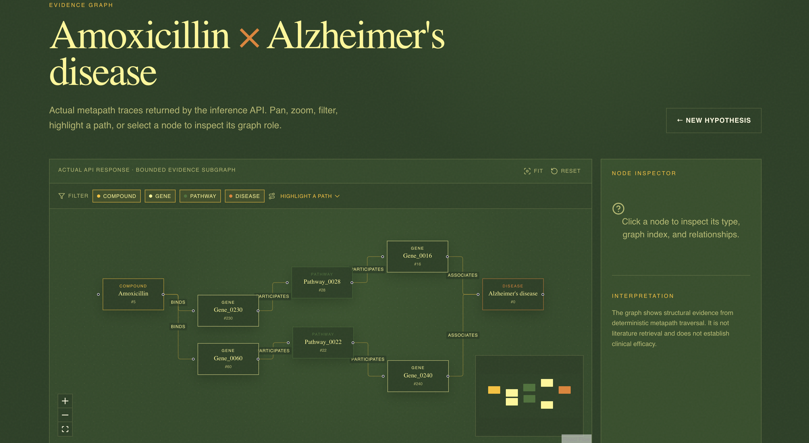

# HELIX-X Biomedical Intelligence

HELIX-X is a local biomedical intelligence prototype for exploring compound-disease hypotheses with a heterogeneous graph neural network. It combines a FastAPI inference service with a Next.js and React interface for candidate ranking and deterministic graph evidence.

## What It Does

- Loads a Hetionet-shaped heterogeneous graph with typed biomedical entities and relationships.
- Encodes the graph with a three-layer Heterogeneous Graph Transformer (HGT).
- Caches node embeddings once at backend startup.
- Scores Compound -> treats -> Disease pairs with a hybrid DistMult, TransE, and dot-product decoder.
- Ranks candidate diseases for compounds and candidate compounds for diseases.
- Returns bounded, deterministic metapath evidence graphs for inspection.

The current checkout is demo-ready: when the real graph and node mappings are absent, it uses a deterministic synthetic Hetionet-like graph with the included trained checkpoint. Demo scores are not scientifically meaningful.

## Architecture

```text
Next.js + React + TypeScript
        |
        | REST / JSON
        v
FastAPI (/api/v1 and /api)
        |
        +-- graph loader: real Hetionet or synthetic demo graph
        +-- 3-layer HGT encoder
        +-- cached node embeddings
        +-- hybrid link decoder
        +-- deterministic metapath evidence
```

## Features

- Searchable compound and disease selectors.
- Pairwise model-score predictions.
- Top-k candidate workflows in both directions.
- Interactive evidence graph with filtering, path highlighting, zoom, and node inspection.
- Methodology and runtime status views.
- Explicit demo, production, and unavailable states.
- No external API key, LLM, PubMed, or literature retrieval dependency.

## Screenshots





## Technology Stack

- Python, PyTorch, and PyTorch Geometric
- FastAPI, Uvicorn, and Pydantic
- Next.js, React, TypeScript, and Tailwind CSS
- React Three Fiber and Three.js for the conceptual knowledge-field visualization
- React Flow for returned evidence subgraphs

## Backend API

The service listens on `http://127.0.0.1:8000` by default. OpenAPI documentation is available at `/docs`.

| Method | Endpoint | Purpose |
| --- | --- | --- |
| GET | `/api/v1/health` | Lightweight health status |
| GET | `/api/v1/status` | Graph, checkpoint, embedding, and runtime state |
| GET | `/api/v1/entities/compounds` | Compound catalog |
| GET | `/api/v1/entities/diseases` | Disease catalog |
| POST | `/api/v1/predict` | Score one compound-disease pair |
| POST | `/api/v1/candidates/diseases` | Rank diseases for a compound |
| POST | `/api/v1/candidates/compounds` | Rank compounds for a disease |
| POST | `/api/v1/evidence/graph` | Return a deterministic evidence graph |
| GET | `/api/v1/methodology` | Model and explanation details |

The equivalent `/api/...` routes are also available for compatibility with the frontend configuration.

Example request:

```bash
curl -X POST http://127.0.0.1:8000/api/v1/predict \
  -H 'Content-Type: application/json' \
  -d '{"compound_id": 0, "disease_id": 0}'
```

The response includes the selected entities, a `model_score`, an evidence path count, an evidence graph, and a scientific notice. Scores are ranking outputs, not calibrated probabilities.

## Running Locally

From this repository root:

```bash
python3 -m venv .venv
.venv/bin/pip install -r requirements.txt
cp .env.example .env
PYTHONPATH=. .venv/bin/python backend/run.py
```

In another terminal:

```bash
cd frontend
npm ci
npm run dev
```

Open `http://127.0.0.1:5173`. The frontend uses `NEXT_PUBLIC_API_URL`, which defaults to `http://127.0.0.1:8000/api/v1`.

## Environment Variables

`.env.example` documents the backend mode, graph paths, checkpoint path, host and port, device, logging level, CORS origins, and frontend API URL. `.env` files are ignored and must contain local values only.

Important modes:

- `auto`: load the real graph when present, otherwise use the demo graph when allowed.
- `demo`: explicitly permit the deterministic synthetic graph.
- `production`: require the real graph, mappings, compatible checkpoint, and successful embedding generation.

## Model and Data

The included `assets/model_epoch8_score0.3792.pt` is the trained state dictionary used by the demo runtime. The application expects these optional production inputs:

```text
data/hetionet_data.pt
data/node_mappings.json
```

The repository does not include the real Hetionet graph or mappings. The checkpoint is about 54 MB and is retained because it is required for the included demo inference path. Git LFS is not configured in this checkout; use Git LFS or external artifact storage if future model files exceed GitHub's normal file limits.

## Demo vs Production

**Demo:** a deterministic synthetic Hetionet-like graph with the included trained weights. It exists to exercise the API and UI end to end.

**Production:** a compatible real Hetionet graph, node mappings, and validated model checkpoint supplied through the configured paths. Production mode is not enabled by the current repository contents alone.

## Scientific Limitations

- Model scores are ranking hypotheses, not calibrated probabilities.
- Graph paths are structural traversals, not literature evidence.
- A graph path does not establish biological causality.
- Results do not establish clinical efficacy or treatment effectiveness.
- HELIXX is a research prototype, not a clinical decision system.

## Project Structure

```text
graphrag-streamlit/
|-- backend/
|   |-- app/
|   |   |-- check.py
|   |   |-- config.py
|   |   |-- main.py
|   |   |-- schemas.py
|   |   `-- service.py
|   `-- run.py
|-- src/
|   |-- explainer.py
|   |-- graph_loader.py
|   |-- inference.py
|   `-- model.py
|-- frontend/
|   |-- app/
|   |-- src/
|   |-- package.json
|   `-- package-lock.json
|-- tests/
|-- assets/model_epoch8_score0.3792.pt
|-- data/.gitkeep
|-- .env.example
|-- .gitignore
|-- requirements.txt
`-- README.md
```

## Testing

Install the Python dependencies, then run:

```bash
PYTHONPATH=. .venv/bin/python -m unittest discover -s tests -p 'test_*.py'
PYTHONPATH=. .venv/bin/python -m backend.app.check
```

Use `--strict` with the self-check only when real production graph artifacts have been supplied.

## License

No license file is currently present. Add a license before distributing the repository publicly.
